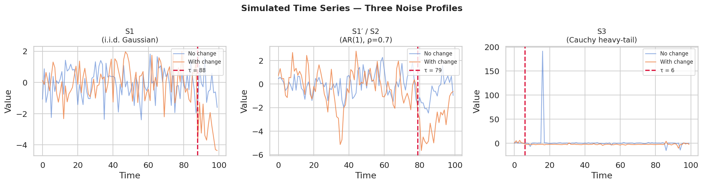
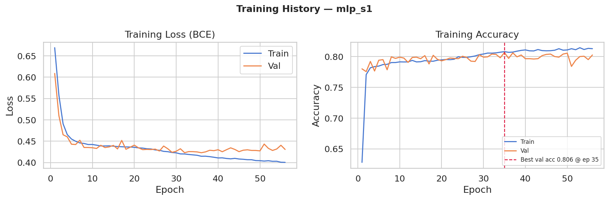
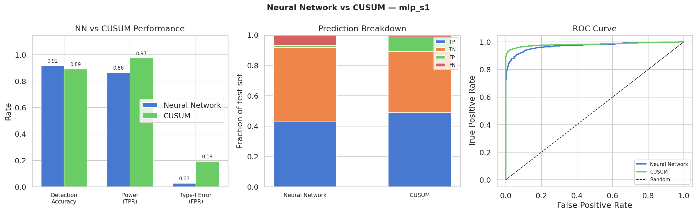
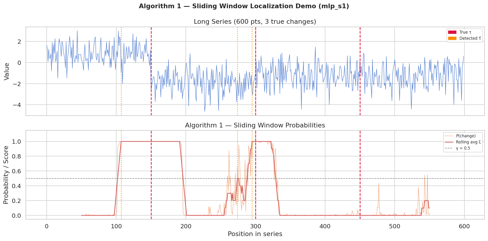

# Automatic Change-Point Detection via Deep Learning

A PyTorch reimplementation of the framework from:

> Jie Li, Paul Fearnhead, Piotr Fryzlewicz, Tengyao Wang, *"Automatic change-point detection in time series via deep learning"*

The core idea: recast offline change-point detection as **supervised binary classification**. A neural network is trained to predict whether a short sequence of length *n* contains a change point (Y=1) or not (Y=0). Once trained, a sliding-window algorithm localizes change points in longer series.

> **Synthetic reproducibility note:** the canonical teacher-facing workflow now uses the fixed datasets in `data/paper_faithful/` plus a single entrypoint, `python scripts/reproduce_synthetic.py`. HASC is not part of that reproducibility path.

---

## Results at a Glance

Fresh results on the canonical `paper_faithful` test splits are:

| Experiment | Test Acc | Power | FPR |
|---|---:|---:|---:|
| `mlp_s1` | 0.9190 | 0.8650 | 0.0270 |
| `rescnn_s1_paper` | 0.9255 | 0.8740 | 0.0230 |
| `mlp_s1prime` | 0.7290 | 0.6940 | 0.2360 |
| `rescnn_s1prime_paper` | 0.7435 | 0.6140 | 0.1270 |
| `mlp_s2` | 0.7540 | 0.6730 | 0.1650 |
| `rescnn_s2_paper` | 0.7525 | 0.6750 | 0.1700 |
| `mlp_s3` | 0.5970 | 0.7730 | 0.5790 |
| `rescnn_s3_paper` | 0.9475 | 0.9220 | 0.0270 |

Direct comparison against the authors' TensorFlow/Keras AutoCPD MLP on those
same canonical splits is:

| Experiment | Test Acc | Power | FPR |
|---|---:|---:|---:|
| `autocpd_s1_paper` | 0.9125 | 0.8710 | 0.0460 |
| `autocpd_s1prime_paper` | 0.7335 | 0.6960 | 0.2290 |
| `autocpd_s2_paper` | 0.7475 | 0.6840 | 0.1890 |
| `autocpd_s3_paper` | 0.5000 | 1.0000 | 1.0000 |

The shared CUSUM baseline on those same canonical test splits is:

| Scenario | CUSUM Acc | CUSUM Power | CUSUM FPR |
|---|---:|---:|---:|
| `S1` | 0.8915 | 0.9750 | 0.1920 |
| `S1'` | 0.5005 | 1.0000 | 0.9990 |
| `S2` | 0.5000 | 1.0000 | 1.0000 |
| `S3` | 0.5110 | 1.0000 | 0.9780 |

These numbers are generated, not hand-maintained. The canonical teacher-facing summary lives at:

- `artifacts/synthetic/summary.md`
- `artifacts/synthetic/manifest.json`
- `comparison/results/AUTOCPD_PAPER_FAITHFUL_SUMMARY.md`

Those files are regenerated from the fixed synthetic datasets and the current trained artifacts. On these canonical splits, ResCNN is slightly ahead on `S1`, clearly better on `S1'`, tied on `S2`, and dramatically better on `S3`. The direct AutoCPD rerun is close to the PyTorch MLP on `S1`, `S1'`, and `S2`, but collapses on heavy-tailed `S3` under the original shallow-MLP + min-max setup. Localization is intentionally kept out of this fixed-window table; the deterministic localization demo is regenerated separately in `models/mlp_s1/plots/fig4_localization_demo.png`.

---

## Visualizations

### Simulated Data — Three Noise Profiles



Three supported noise types:
- **S1** (i.i.d. Gaussian) — standard independent noise
- **S1'/S2** (AR(1)-style dependence) — autocorrelated noise
- **S3** (Cauchy heavy-tail) — extreme spikes; uses the repo's robust preprocessing path

### Training Curves



For the fresh canonical run, `mlp_s1` trained for 118 epochs and reached best validation accuracy `0.9700` at epoch 109. The training history figure is regenerated from `models/mlp_s1/history.json`.

### Neural Network vs CUSUM



On the canonical `s1_test` split, `mlp_s1` reached `0.9190` accuracy with `0.0270` FPR, `rescnn_s1_paper` reached `0.9255` accuracy with `0.0230` FPR, and CUSUM reached `0.8915` accuracy with `0.1920` FPR. The figure shows the fixed-window metrics, a prediction breakdown on the canonical test split, and the ROC curve.

### Algorithm 1 — Localization Demo



This is a deterministic synthetic localization demo for `mlp_s1`. It is regenerated by the canonical pipeline, but localization is not part of the fixed-window summary table in `artifacts/synthetic/summary.md`.

---

## Architecture

### Model 1 — MLP (single mean changes)

```
Input x in R^n
    ↓
Linear(n → h) → ReLU → Linear(h → 1)   [raw logit]
```

Hidden layer width `h` has two variants:
- **Full**: `h = 2n − 2` — theoretically proven to replicate the CUSUM statistic
- **Pruned**: `h = 4 · ⌊log₂ n⌋` — near-identical accuracy with ~8× fewer parameters

For n=100: full → h=198 (~20K params), pruned → h=24 (~2.4K params).

### Model 2 — Residual CNN (complex/multiple changes)

```
Input x ∈ ℝ^(1×n)
    ↓
Conv1d(1→32, k=1)           ← input projection
    ↓
ResidualBlock × 7            (32→32 channels)
    ↓
ResidualBlock × 1            (32→64 channels)  ← channel expansion
    ↓
ResidualBlock × 13           (64→64 channels)
    ↓
AdaptiveAvgPool1d(1)         ← collapse temporal dim
    ↓
Linear(64→64) → ReLU → Linear(64→1)   [raw logit]
```

Each residual block: `Conv1d → BN → ReLU → Conv1d → BN + skip → ReLU`.
Same-padding (`pad = kernel_size // 2`) preserves sequence length throughout.
The model is length-agnostic via `AdaptiveAvgPool`.

---

## Data Pipeline

```
simulate_dataset(N, n, noise_type)
    ↓  X: (N, n),  y: (N,),  taus: (N,)
augment_reversed()           ← doubles N; reversed sequences share same label
    ↓  X: (2N, n)
apply_pretransform()         ← optional: append x², cross-products for variance detection
    ↓  X: (2N, n')
minmax_scale() / trimmed_scale()   ← per-sequence normalization
    ↓
make_dataloaders(flatten=True/False)   ← (n,) for MLP, (1,n) for CNN
    ↓
Trainer.train(train_loader, val_loader)
```

For the canonical reproducibility path, the training and test inputs come from the fixed NPZ files under `data/paper_faithful/`:

- `s1_train.npz`, `s1_test.npz`
- `s1prime_train.npz`, `s1prime_test.npz`
- `s2_train.npz`, `s2_test.npz`
- `s3_train.npz`, `s3_test.npz`

Each file contains `X`, `y`, and `taus`. The matching `.hash.txt` files are used by `scripts/generate_reproducible_data.py --verify`.

---

## Training

| Hyperparameter | Value |
|---|---|
| Loss | BCEWithLogitsLoss |
| Optimizer | Adam |
| Learning rate | 0.001 |
| Epochs | up to 200 |
| Batch size | 32 |
| Early stopping | patience = 20 epochs |

Models output raw logits. Sigmoid is applied post-hoc at inference only — `BCEWithLogitsLoss` fuses sigmoid + cross-entropy in log-space for numerical stability.

---

## Deployment — Algorithm 1 (Localization)

```
Given: long series T of length M, trained model, window size n

1. SLIDE    extract windows T[i : i+n] with step size s
2. SCORE    p_i = P(change | window_i),  L_i = 1{p_i ≥ 0.5}
3. SMOOTH   L̄_i = rolling average of L over a window of width w
4. SEGMENT  find maximal contiguous runs where L̄_i ≥ γ (default 0.5)
5. LOCALIZE τ̂ = argmax(L̄_i) within each segment
```

Windows straddling the true change point score high; windows entirely before or after score low. The peak of the probability signal localizes the change.

---

## Project Structure

```
change_point_detection/
├── configs/               YAML experiment configs used by the canonical pipeline
│   ├── mlp_s1.yaml
│   ├── mlp_s1prime.yaml
│   ├── mlp_s2.yaml
│   ├── mlp_s3.yaml
│   ├── rescnn_s1_paper.yaml
│   ├── rescnn_s1prime_paper.yaml
│   ├── rescnn_s2_paper.yaml
│   └── rescnn_s3_paper.yaml
├── data/
│   └── paper_faithful/    Canonical reproducible synthetic train/test splits
│       ├── s1_*.npz       Data used for the S1 rows in the README tables
│       ├── s1prime_*.npz  Data used for the S1' rows in the README tables
│       ├── s2_*.npz       Data used for the S2 rows in the README tables
│       ├── s3_*.npz       Data used for the S3 rows in the README tables
│       └── plots/         Canonical dataset overview figures
├── models/
│   ├── mlp_s1/            Canonical MLP artifacts; metrics in eval_results.json
│   ├── mlp_s1prime/
│   ├── mlp_s2/
│   ├── mlp_s3/
│   ├── rescnn_s1_paper/   Canonical ResCNN artifacts; metrics in eval_results.json
│   ├── rescnn_s1prime_paper/
│   ├── rescnn_s2_paper/
│   ├── rescnn_s3_paper/
│   ├── autocpd_s1_paper/  AutoCPD MLP artifacts on the same canonical splits
│   ├── autocpd_s1prime_paper/
│   ├── autocpd_s2_paper/
│   └── autocpd_s3_paper/
├── artifacts/
│   └── synthetic/
│       ├── summary.md     Canonical MLP/ResCNN summary shown in the README
│       └── manifest.json  Dataset hashes and artifact provenance
├── output/
│   └── comparison/
│       ├── figure2_comparison.png    Canonical comparison chart shown in Chapter 4
│       └── comparison_results.json   Metrics used to draw that chart
├── comparison/
│   ├── results/
│   │   └── AUTOCPD_PAPER_FAITHFUL_SUMMARY.md   AutoCPD table shown in the README
│   └── scripts/
│       └── train_autocpd_paper_faithful.py     Runs the author's MLP on canonical splits
├── src/
│   ├── config.py          ExperimentConfig dataclasses + YAML I/O
│   ├── data/
│   │   ├── simulator.py   Sequence simulation (S1/S2/S3 noise profiles)
│   │   ├── paper_faithful.py  Canonical NPZ loading helpers
│   │   ├── transforms.py  Scaling, augmentation, pre-transforms
│   │   └── dataset.py     PyTorch Dataset + DataLoader factory
│   ├── models/
│   │   ├── mlp.py         MLPDetector (full / pruned variants)
│   │   └── rescnn.py      ResidualCNN
│   ├── training/
│   │   └── trainer.py     Training loop, checkpointing, early stopping
│   ├── inference/
│   │   └── localizer.py   Algorithm 1: sliding-window localization
│   └── evaluation/
│       ├── metrics.py     Power, FPR, localization error, ROC
│       └── baselines.py   Two-sided CUSUM baseline
├── scripts/
│   ├── reproduce_synthetic.py       Canonical one-command synthetic pipeline
│   ├── generate_reproducible_data.py
│   ├── plot_canonical_synthetic_comparison.py
│   ├── train.py
│   ├── evaluate.py
│   ├── locate.py
│   ├── visualize.py
│   └── visualize_paper_faithful_data.py
└── tests/                 Reproducibility and model smoke tests
```

The README tables are backed by concrete files:
- MLP/ResCNN rows are summarized in `artifacts/synthetic/summary.md` and traced back to `models/*/eval_results.json`.
- AutoCPD rows are summarized in `comparison/results/AUTOCPD_PAPER_FAITHFUL_SUMMARY.md` and traced back to `models/autocpd_*/eval_results.json`.
- The Chapter 4 comparison figure is drawn from `output/comparison/comparison_results.json`, which is regenerated from those same saved `eval_results.json` files.
- Dataset provenance and hashes are recorded in `artifacts/synthetic/manifest.json`.

---

## Quickstart

### Environment

```bash
conda env create -f environment.synthetic.yml
conda activate change-point-synthetic
```

### One command

```bash
python scripts/reproduce_synthetic.py
```

That command will:

1. create or verify the canonical synthetic datasets in `data/paper_faithful/`
2. train the canonical MLP and ResCNN experiments
3. evaluate them on the fixed test splits
4. regenerate the teacher-facing synthetic plots
5. write `artifacts/synthetic/manifest.json` and `artifacts/synthetic/summary.md`

### Step-by-step breakdown

```bash
python scripts/generate_reproducible_data.py

python scripts/train.py --config configs/mlp_s1.yaml --device cpu
python scripts/train.py --config configs/rescnn_s1_paper.yaml --device cpu
python scripts/train.py --config configs/mlp_s1prime.yaml --device cpu
python scripts/train.py --config configs/rescnn_s1prime_paper.yaml --device cpu
python scripts/train.py --config configs/mlp_s2.yaml --device cpu
python scripts/train.py --config configs/rescnn_s2_paper.yaml --device cpu
python scripts/train.py --config configs/mlp_s3.yaml --device cpu
python scripts/train.py --config configs/rescnn_s3_paper.yaml --device cpu

python scripts/evaluate.py --experiment mlp_s1 --device cpu
python scripts/evaluate.py --experiment rescnn_s1_paper --device cpu
python scripts/evaluate.py --experiment mlp_s1prime --device cpu
python scripts/evaluate.py --experiment rescnn_s1prime_paper --device cpu
python scripts/evaluate.py --experiment mlp_s2 --device cpu
python scripts/evaluate.py --experiment rescnn_s2_paper --device cpu
python scripts/evaluate.py --experiment mlp_s3 --device cpu
python scripts/evaluate.py --experiment rescnn_s3_paper --device cpu

python scripts/visualize.py --experiment mlp_s1 --device cpu
python scripts/visualize_paper_faithful_data.py
python scripts/plot_canonical_synthetic_comparison.py

python scripts/reproduce_synthetic.py --step manifest
python scripts/reproduce_synthetic.py --step verify
```

### Run tests

```bash
python -m pytest tests/ -v
```

Current lightweight suite: `16` passing tests, including reproducibility checks plus `10` ResCNN unit tests covering residual blocks, forward shape, logits/probabilities, binary helpers, variable-length inputs, and the multiclass head.

---

## Configuration Reference

All experiments are controlled by YAML files. Key fields:

```yaml
experiment_name: mlp_s1

dataset:
  source: simulated
  data_dir: data/paper_faithful
  n: 100
  N: 10000
  noise_type: S1
  rho: 0.0
  sigma: 1.0
  snr_based_mu: true
  seed: 42

model:
  architecture: mlp        # mlp | rescnn
  mlp_variant: pruned      # full | pruned
  use_squared: false
  use_cross_product: false

training:
  epochs: 200
  batch_size: 32
  patience: 20
  augment_reversed: true

localization:
  window_size: 100
  step_size: 1
  rolling_window: 10
  gamma: 0.5
```

---

## Reference

Jie Li, Paul Fearnhead, Piotr Fryzlewicz, Tengyao Wang (2024).  
*Automatic Change-Point Detection in Time Series via Deep Learning.*  
Journal of the Royal Statistical Society: Series B.
